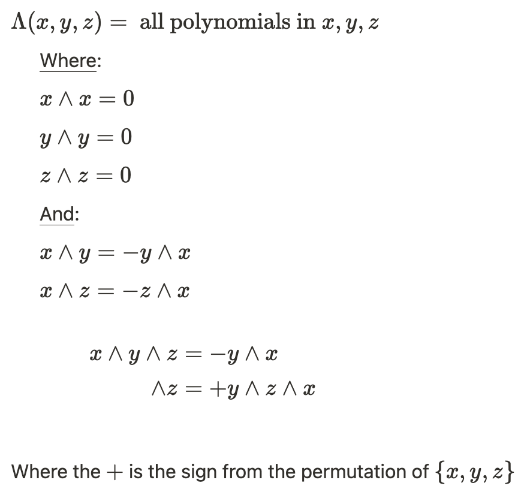
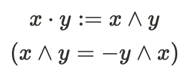

## June 3rd, 9:00 AM
#### M2 Workshop @ Madison
* Book Accomodations  
What **hotel/apartment** are we staying at?  
* Book St. Olaf Van → Driver: [_Sam_](strom9@stolaf.edu)
* CLEAR schedules June 29th - July 5th  
This means you don't get to celebrate America.

#### Full Project Goals
* Tulane ... and on Invariant Rings repo
* Checkon what is on Tulane Repo
* Follow up with participants at Tulane (Orbit Sum → Sam)
* Talk to Prof. Mastroeni
* Skew Invariants? (I have no idea what this means )

#### Overview of Tasks for Week 1
We will try and achieve  goals for **Mathematical Theory development**, **Coding**, and **Professional Development** by the end of the week.  
##### <u>Math Theory</u>
* Define **Invariant Ring**
 \+ Do initial exercises with invariant rings
* Invairnat Theory in **M2**
* Prepare **Representation Theory**
* Prepare for **Gröbner Basis** for next week
##### <u>Coding</u>
* Learn **M2** Language
  → Tutorials on Web
* M2 Codespace
  → Tutorials on our book
* First chapters of GitHub for Mathematicians
  * Gordie works on local PreTeX setup
* PreTeX language
* PreTeX codespace
##### <u>Professional</u>
* GitHub Education
* Update GitHub profile
* Professional Development workshop on Wednesday 12-1
* Fix typos, give feedback on papers

## June 3rd, 12:00 PM
#### Book Topics
We will cover the various topics that the new textbook should cover to educate new people on the processes for this CURI Project.
* Representation Theory
* Abelian Case → How do you make the action diagonal <u>in M2</u>?
* Examples  
  → Math \& Code
* Permutation Action
* Algorithms \& Degree Bounds
* Gröbner Bases, and  Elimination Theory
* Skew Invariants
*  Separate Section:  Subspace arrangement approach

Here are some additional notes on actually defining our behavior in our skew commutative ring:

It's important to note that we define our wedge operation as:

